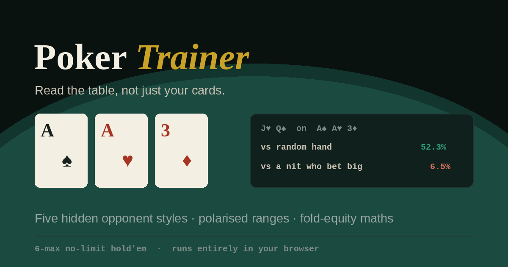

# ChipAway

**[▶ Play it](https://tommmmiller.github.io/ChipAway/)** — no install, no sign-up, runs entirely in your browser.

A 6-max no-limit hold'em trainer built around one idea: **you should be reading ranges, not hands.** Five opponent styles sit at the table with their identities hidden, and you work out who's who from how they play.



> **[Read the full maths →](MATHS.md)** — every formula derived, including the two that unit tests caught me getting wrong.

## Why it isn't just another poker game

Most practice apps deal you cards and let you click buttons. This one models what the opponents could actually be holding.

**Range-aware equity.** Opponents aren't random hands — each carries a range implied by how they've acted, which tightens when they bet and widens as the board changes. The difference is not subtle:

| J♥Q♠ on an A♠A♥3♦ flop, opponent modelled as… | Your equity |
|---|---|
| A random hand (what most tools show you) | 52.3% |
| Someone who called earlier | 31.5% |
| A loose-aggressive player who bet | 24.2% |
| A tight player who bet big | **6.5%** |

Same cards, same board. Everything that changed is what you know about them.

**Polarised ranges.** Big bets aren't "top 15%" — they're the nuts plus bluffs, with medium hands checking. That's what makes bluff-catching possible.

**Fold-equity maths.** For every bet size: what you risk, the fold rate you need to break even, and the fold rate that opponent's range actually gives you.

| Pot of 100 | ½ pot | ¾ pot | pot | 1.5× pot |
|---|---|---|---|---|
| vs the nit | 66% ✓ | 73% ✓ | 78% ✓ | 87% ✓ |
| vs the calling station | 21% ✗ | 28% ✗ | 33% ✗ | 42% ✗ |

Bluffing the nit prints at any size. Bluffing the station never works at any size.

**Decision EV review.** After every hand, each of your decisions is scored in chips against the best line that was available at that moment. Not "you lost" — *"on the flop you had 22% into a pot of 120; a ¾-pot bet would have folded them 66% of the time, worth about +77 against your check."* Validated against hand-computed cases: a call at exactly pot odds scores 0.00, as it must.

**Session EV graph.** A cumulative line of chips leaked to non-optimal decisions. This separates "played well, got unlucky" from "played badly, got lucky" — something raw win/loss can never do. In testing it separates a player who always takes the highest-EV line (5.4 chips/hand) from one acting at random (348 chips/hand).

**Leak of the session.** One sentence, not a wall of stats: the single most costly pattern in your play right now, weighted by severity.

**Range-width trend.** A rolling 12-hand VPIP sparkline, so you can see yourself tightening or loosening across a session.

**Stats persist** across reloads via localStorage, with a reset button.

**Value extraction.** The mirror of fold equity: when you're ahead, a panel shows which bet size actually maximises what you win. Betting more raises the amount but also the chance they fold, and that product peaks somewhere. Against a station the answer is 1.5× pot; against a player repping one pair it's ⅔ pot.

**Read scoring.** Before any cards turn over, you commit to what you think they have. Accuracy is tracked by street.

**A read on you.** VPIP, PFR, aggression factor and fold-to-3-bet, matched against the five archetypes to tell you which one *you* are playing like — plus an alert when your last dozen hands drift passive.

**Counterfactual runouts.** Folded and wondered? The board is completed 2,200 times with everyone's real cards to tell you whether you were ahead.

## Running it locally

Install [Node.js 22](https://nodejs.org/), then run:

```bash
npm install
npm run dev
```

The macOS and Linux launchers in [`local/`](local/) run those steps for you. For a production check, use `npm run build` followed by `npm run preview`.

## How it's built

The interface is a Vite-powered React application split into focused components under [`src/components/`](src/components/). The established poker simulation is isolated behind a single initializer in [`src/engine/initializePokerTrainer.js`](src/engine/initializePokerTrainer.js), keeping the game maths separate from the interface while preserving its behaviour.

The engine remains organised into numbered sections:

| | | | |
|---|---|---|---|
| 1 Card engine | 2 Hand evaluator | 3 Range model | 4 Equity |
| 5 Profiles | 6 Game state | 7 Rendering | 8 Equity panel |
| 9 Side pots | 10 Betting | 11 Bot decisions | 12 Guessing |
| 13 Stats & fold equity | 14 Wiring | | |

Hand evaluation checks all 21 five-card combinations from seven cards. Equity is Monte Carlo with opponents sampled from their implied ranges and your known cards blocked out. Side pots are built by ascending commitment level — verified across 130 simulated hands, every pot balancing against chips committed.

## The maths

Everything the app computes is documented and derived in **[MATHS.md](MATHS.md)**: hand evaluation and the base-15 packing trick, Monte Carlo error bounds, the range model, pot odds, EV of every action, fold equity and minimum defence frequency, side-pot construction, logistic mixed strategies, and the style classifier.

Three highlights if you only read one section:

**Folding is always EV 0.** Not approximately — by definition. Chips in the pot aren't yours, so folding neither gains nor loses relative to now. Every other option is measured against that zero, which is precisely why "I've already put so much in" is a fallacy.

**Betting has two ways to win, calling has one.**

$$\mathrm{EV}_{\text{bet}} = \underbrace{f \cdot P}_{\text{they fold}} + \underbrace{(1-f)\big[e(P+B) - (1-e)B\big]}_{\text{they call}}$$

That first term is the entire argument for aggression, and it's why a bet can beat a call even with weak equity.

**Break-even bluff frequency and minimum defence frequency sum to 100%.** A pot-sized bluff needs folds more than 50% of the time; the defender must therefore continue at least 50%. Both fall out of the same indifference condition viewed from opposite sides.

## Known limits

- **No board texture.** Bots evaluate their own hand but never ask whether a flop favours their range or yours. This is the biggest remaining gap.
- Ranges are strength quantiles rather than tracked combo sets, so preflop information is lost once the flop lands.
- Session stats are stored only in this browser, so they do not sync between devices.

## Roadmap

- [ ] Board texture and range-versus-range advantage
- [ ] Weighted combo ranges with Bayesian updating (subsumes most of the above)
- [ ] 13×13 grid range painter for read training
- [ ] Bot profiles calibrated against real hand-history data
- [ ] Post-hand coaching commentary

## Feedback

Open an issue, or use the **Send feedback** panel at the bottom of the app.

## Licence

MIT — see [LICENSE](LICENSE).
